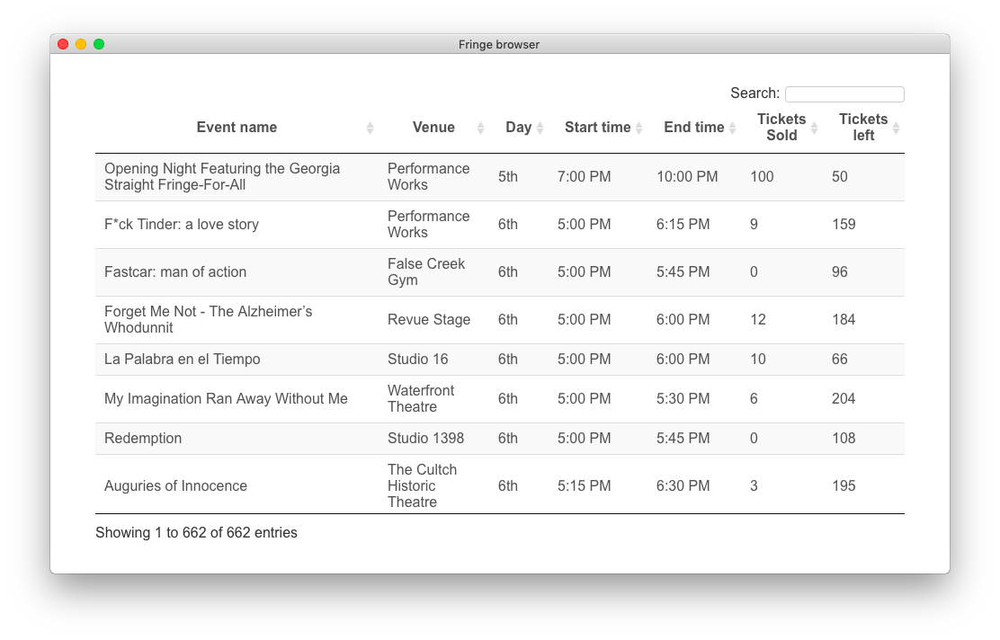

# vanfringe-browser

This is a little app to browse upcoming shows at the vancouver fringe. It communicates directly with the feed feature of eSRO.





## Quickstart

```sh
$ git clone https://github.com/Falkirks/vanfringe-browser
$ cd vanfringe-browser
$ npm install
$ npm start
```
